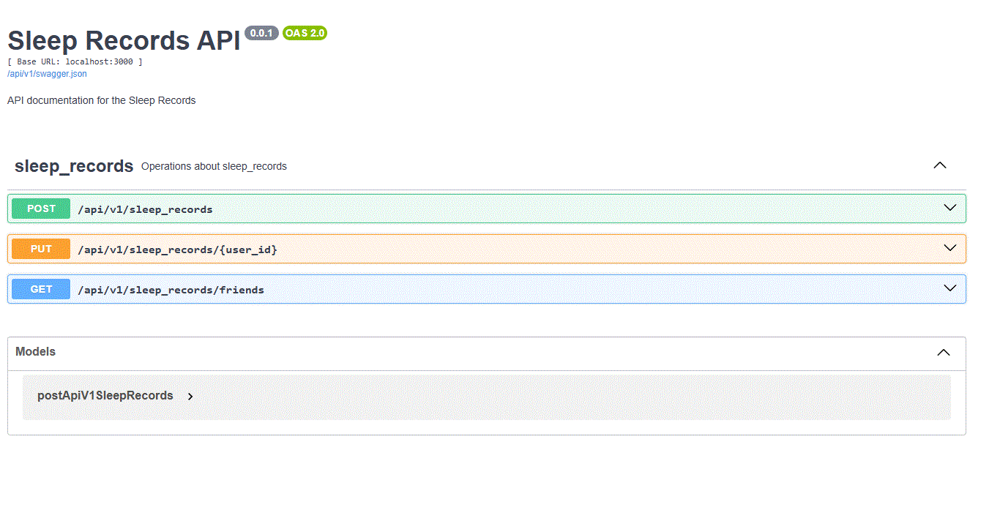

This project was created as part of a take-home assignment, but is also structured as a clean, scalable portfolio piece showcasing backend fundamentals, API design, and performance awareness.

A simple sleep-tracking API built with Ruby on Rails.  
Users can clock in their sleep time see how well their friends are resting.

---

## Features


- Clock in/out to record sleep sessions
- Retrieve previous week's sleep data from followed users
- Scalable design with pagination, caching

---

## Tech Stack

- **Ruby on Rails**
- **PostgreSQL**
- **Grape** — lightweight REST API framework
- **Pagy** — pagination
- **Swagger** — auto-generated API docs

---

## Setup Instructions

```bash
# Clone the repo
git clone git@github.com:anthony-devhub/sleep-service.git
cd sleep-service

# Install dependencies
bundle install

# Setup DB
rails db:setup

# Run the server
rails server

```

---

## API Documentation (Swagger)

Here's a preview:



---

## Performance Notes

-  **Microservice Isolation**: This service does not query user or follow data directly. Instead, it makes external HTTP calls to the User Service, meaning N+1 avoidance is not handled within this service. In a monolith or merged service, we would use `includes` or `preload` to mitigate N+1 issues.

- **Indexing**: Appropriate DB indexes are in place for queries.

- **Caching**: Follower feed results are cached per user (Rails.cache) with 5-minute expiry to reduce expensive DB aggregation.

- **Pagination**: Limits and offsets are applied to queries via params (page, limit) for scalability.

---

## Author

**Anthony Salim**

Senior Ruby on Rails Backend Developer

🇮🇩 Indonesia | 🌐 Open to remote roles.

Let’s build something cool together!

📧 anthonysalim.dev@gmail.com